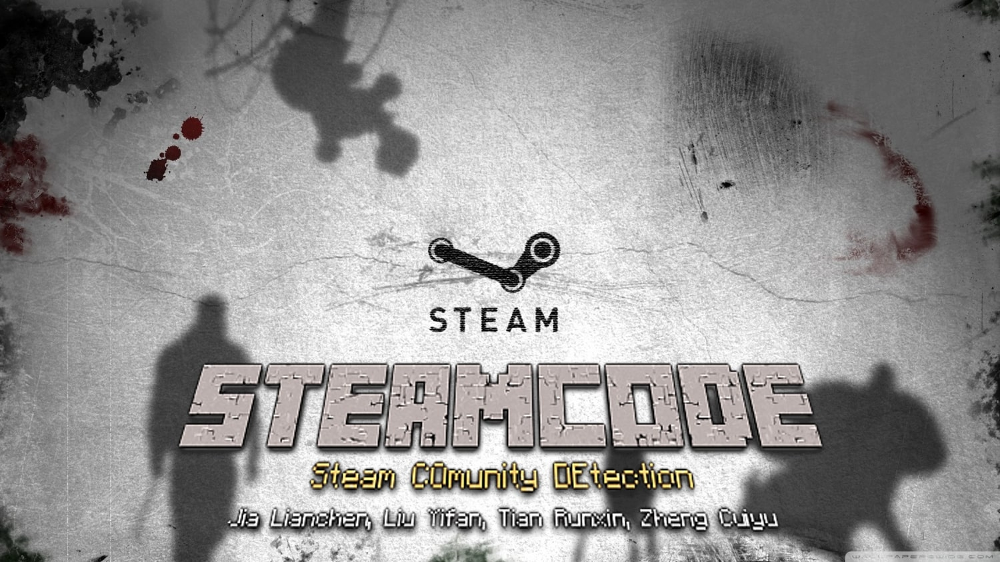
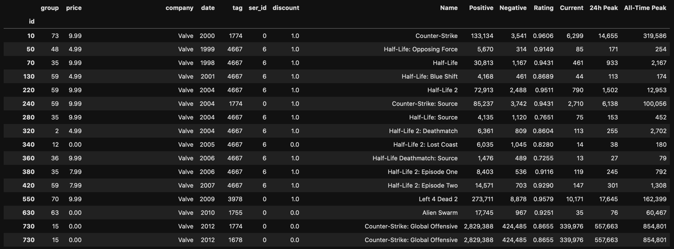

# STEAMCODE - Community Detection on Steam Games

### Team 7

**Tian Runxin**, 	2016, Southern University of Science and Technology

**Zheng Cuiyu**, 	2016, Zhejiang University

**Jia Lianchen**,	 2017, Harbin Engineering University

**Liu Yifan**,			2017, Xi'an Jiaotong University

**Team Leader: Tian Runxin**

---

1. Fast go trough the [project](#poster)

2. How to [Run](#Deploy)
3. Result [Visualization](https://blog.aaron-xin.tech/SteamCODE/) (using d3-3d framework[[3]](#Reference))

## Decription

Our project aims to investigate the similarity between **header pictures** (tiny posters) of **games** on the **Steam[1] game platform**, and find the relationship between header pictures, game categories and popularity, etc. For example, games belong to the same category may have similar header pictures.

## Dataset & Subclasses

- **Kind of data**: Header (tiny poster) image of Steam games (460x215) in .jpg format.
- **Source**: The images are from [Steam](https://store.steampowered.com/)[1] and the data for further analysis is from [Steamdb](http://steamdb.info)[2].
- **Preprocessing**: 
  - It is needed to confirm that all the games have such a header image. 
  - Normal image preprocessing for CNN.
  - Wash the data for further analysis.
- **Additional data**: It shown below in ***APIs*** part.

### APIs

1. Game Header Poster

   

   Source: [https://steamcdn-a.akamaihd.net/steam/apps/[APPID]/header.jpg](https://steamcdn-a.akamaihd.net/steam/apps/10/header.jpg)

4. Game Detail (Additional data for analysis)

   [https://steamdb.info/app/[APPID]/info/](https://steamdb.info/app/620/info/)

   

5. Game tags (Data to confirm our expected results)

   https://steamdb.info/tags/

   

## Reference

[[1]](https://store.steampowered.com) Steam is a video game digital distribution platform developed by Valve Corporation.

[[2]](steamdb.info) Steamdb is a [third-party](https://steamdb.info/faq/#who-is-behind-this-website) tool, which was made to give better insight into the applications and packages that [Steam](https://store.steampowered.com/) has in its database.

[3] https://github.com/Niekes/d3-3d

# Poster

# Deploy

To be continue...

If you really want to know the deployment method, please contact [me](airine@gmail.com).